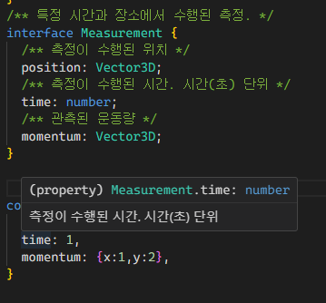

# DIL: 이펙티브 타입스크립트

> 스터디: 월간 CS, https://github.com/monthly-cs/2024-05-effective-typescript  
> 작성일: 2024-06-15
> 작성자: csyun

--- 

## [아이템 45] devDependencies에 typescript와 @types 추가하기

### npm (node pakage manager)

npm은 JS 라이브러리 저장소와 프로젝트가 의존하고 있는 라이브러리들의 버전을 지정하는 방법(pakage.json)을ㅈ ㅔ공한다.
3가지 종류의 의존성이 구분된다.

#### dependencies

현재 프로젝트를 실행하는데 필수적인 라이브러리가 포함된다.
프로젝트를 npm에 공개해 다른 사용자가 해당 프로젝트를 설치하면 dependencies에 있는 라이브러리도 함께 설치된다.
이를 전이(transitive) 의존성이라고 한다.

#### devDependencies

개발하고 테스트하는데 사용되지만 런타임에는 필요없는 라이브러리
npm에 공개해 다른 사용자가 해당 프로젝트를 설치하면 devDependencies에 있는 라이브러리는 제외된다.

#### peerDependencies

런타임에 필요하긴 하지만 의존성을 직접 관리하지 않는 라이브러리가 포함된다.

### 타입스크립트

타입스크립트는 개발도구 -> devDependencies에 속한다.
타입스크립트를 전역레벨로 설치할 수 있지만 권하지 않음.

- 팀원 모두가 동일한 버전을 쓴다고 보장할 수 없다.
- 프로젝트를 셋업할때 별도의 단계가 추가된다.

<br />
<br />

## [아이템 46] 타입 선언과 관련된 세 가지 버전 이해하기

타입스크립트를 사용하면 의존성 관리가 더 복잡해진다.

> - 라이브러리 버전
> - 타입 선언(@types)의 버전
> - 타입스크립트의 버전


세 가지 버전 중 하나라도 맞지 않으면 의존성과 상관없어 보이는 곳에서 엉뚱한 오류가 발생할 수 있다.
<br />
라이브러리와 타입 정보의 버전이 별도로 관리되는 방식은 다음과 같은 문제점이 있다.

### 1. 라이브러리를 업데이트 했지만 실수로 타입선언은 업데이트 하지 않은 경우

라이브러리 업데이트와 관련된 새로운 기능을 사용하려 할 때마다 타입 오류가 발생하게 된다.
하위 호환성이 깨지는 변경이 있다면 타입 체커는 통과해도 런타임 오류가 생길 수 있다.

#### 해결법

1. 타입 선언도 업데이트하여 라이브러리와 버전을 맞춘다.
2. 업데이트할 타입 선언이 아직 준비되어 있지 않다면, 보강기법을 사용해 새 함수와 메서드 타입정보를 프로젝트 자체에 추가 한다.
3. 타입 선언의 업데이트를 직접 작성하고 공개하여 커뮤니티에 기여한다.

### 2. 라이브러리보다 타입 선언의 버전이 최신인 경우

- 타입 정보 없이 라이브러리를 사용해 오다가, 타입 선언을 설치하려고 할 때 발생한다.
- 라이브러리와 타입선언의 버전이 맞도록 라이브러리 버전을 올리거나 타입 선언의 버전을 내린다.

### 3. 프로젝트에서 사용하는 타입스크립트 버전보다 라이브러리에서 필요로하는 타입스크립트 버전이 최신인 경우

- 이 오류를 해결하려면 프로젝트의 타입스크립트 버전을 올리거나, 라이브러리 타입 선언의 버전을 내리거나, declare module 선언으로 라이브러리 타입 정보를 없애버리면 된다.
- 타입스크립트의 특정 버전에 대한 타입 정보를 설치하려면 다음을 실행한다.

```
npm install --save-dev @types/lodash@ts3.1

npm install <package>         # dependencies에 추가 (npm 5.0.0 이후 기본값)
npm install <package> --save  # dependencies에 추가 (npm 5.0.0 이전)
npm install <package> --save-dev  # devDependencies에 추가

yarn add <package>            # dependencies에 추가
yarn add <package> --dev      # devDependencies에 추가
```

#### 결론

배포 용도로 필요한 패키지들은 dependencies 필드에,<br />
개발 용도로만 필요한 패키지들은 devDependencies 필드에!


<br />
<br />

## [아이템 47] 공개 API에 등장하는 모든 타입을 익스포트하기

```typescript
interface SecretName {
  first: string
  last: string
}

interface SecretSanta {
  name: SecretName
  gift: string
}

export function getGift(name: SecretName, gift: string): SecretSanta {
  return {
    name: {
      first: 'Dan',
      last: 'Van',
    },
    gift: 'MacBook Pro',
  }
}
```

- 어떤 라이브러리가 위의 코드처럼 SecretName, SecretSanta를 익스포트 하지 않았다.
  getGift만 직접 임포트해서 사용할 수 있다.

- 하지만 타입들은 익스포트된 함수 시그니처에 등장하기 때문에 추출해낼 수 있다.

```typescript
type MySanta = ReturnType<typeof getGift> // SecretSanta
type MyName = Parameters<typeof getGift>[0] // SecretName
```

#### 결론

- 어차피 라이브러리 사용자가 추출할 수 있으므로 export 하기 쉽게 만드는것이 좋다.

<br />
<br />

## [아이템 48] API 주석에 TSDoc 사용하기

### @params와 @returns

함수를 호출하는 부분에서 각 매개변수와 관련된 설명을 보여준다.

```typescript
/**
 *  인사말을 생성합니다.
 *  @param name 인사할 사람의 이름
 *  @param title 그 사람의 칭호
 *  @returns 사람이 보기 좋은 형태의 인사말
 */

function greetFullTSDoc(name: string, title: string) {
  return `Hello ${title} ${name}`;
}
```

<br />

### 타입 정의에 TSDoc

객체의 각 필드에 마우스를 올려 빌드별 설명을 볼 수 있다.

```typescript
interface Vector3D {
}

/** 특정 시간과 장소에서 수행된 측정. */
interface Measurement {
  /** 측정이 수행된 위치 */
  position: Vector3D;
  /** 측정이 수행된 시간. 시간(초) 단위 */
  time: number;
  /** 관측된 운동량 */
  momentum: Vector3D;
}

```



### 마크다운 제공

굵은 글씨(**text**), 기울임 글씨, 글머리기호 목록을 사용할 수 있다

```typescript
/**
 * This _interface_ has **three** properties:
 * # 1. x
 * ## 2. y
 * ### 3. z
 * 4. **t**
 */
interface Vector3D {
  x: number
  y: number
  z: number
}
```