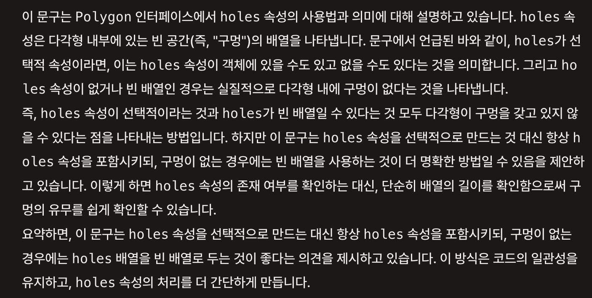

# DIL: 이펙티브 타입스크립트

> 스터디: 월간 CS, https://github.com/monthly-cs/2024-05-effective-typescript  
> 작성일: 2024-05-22<br/>
> 작성자: iamkanguk97

---

## 아이템24: 일관성 있는 별칭 사용하기

```typescript
const borough = {
  name: 'Brooklyn',
  location: [40.688, -73.979],
};
const loc = borough.location; // 별칭(alias)

loc[0] = 0;
console.log(borough.location); // [0, -73.979]
```

**별칭의 값을 변경하면 원래 속성값에서도 변경된다. 하지만 별칭을 남발해서 사용하게 되면 제어 흐름을 분석하기 어렵다. 타입스크립트에서는 별칭을 신중해서 사용해야 한다.**

다음은 다각형을 표현하는 자료구조를 예시로 들은 코드이다.

```typescript
interface Coordinate {
  x: number;
  y: number;
}

interface BoundingBox {
  x: [number, number];
  y: [number, number];
}

interface Polygon {
  exterior: Coordinate[];
  holes: Coordinate[][];
  bbox?: BoundingBox;
}

function isPointInPolygon(polygon: Polygon, pt: Coordinate) {
  const box = polygon.bbox;
  if (polygon.bbox) {
    if (
      pt.x < box.x[0] || // 에러: box 객체가 undefined일 수 있다.
      pt.x > box.x[1] ||
      pt.y < box.y[0] ||
      pt.y > box.y[1]
    ) {
      return false;
    }
  }
  // ...
}
```

기존 코드에서 polygon.bbox가 중복되어 임시 변수로 뺀 후의 결과이다. 하지만 위의 코드는 box가 undefined가 될 수 있다는 오류를 발생시키고 있다.

이러한 오류는 `"별칭은 일관성 있게 사용한다"`는 기본 원칙을 지키면 방지할 수 있다.

```typescript
function isPointInPolygon(polygon: Polygon, pt: Coordinate) {
  const box = polygon.bbox;
  if (box) {
    if (
      pt.x < box.x[0] ||
      pt.x > box.x[1] ||
      pt.y < box.y[0] ||
      pt.y > box.y[1]
    ) {
      // 정상
      return false;
    }
  }
  // ...
}
```

**위의 코드는 타입 체커도 통과하고 크게 문제가 없어 보이지만 코드를 읽는 사람에게는 문제가 남아있다. box와 bbox는 결국 같은 값인데 다른 이름을 사용했다는 것이다.**

이럴 때 `객체 비구조화 문법`을 사용하게 되면 더욱 간결하게 코드를 작성할 수 있다.

```typescript
function isPointInPolygon(polygon: Polygon, pt: Coordinate) {
  const { bbox } = polygon;
  if (bbox) {
    const { x, y } = bbox;
    if (pt.x < x[0] || pt.x > x[1] || pt.y < y[0] || pt.y > y[1]) {
      // 정상
      return false;
    }
  }
  // ...
}
```

하지만 `객체 비구조화 문법`을 사용할 때는 2가지를 조심해야 한다.

- 전체 bbox 속성이 아니라 x와 y가 선택적 속성일 경우에 속성 체크가 더 필요하다. 따라서 타입의 경계에 null 값을 추가하는 것이 좋다.

```typescript
interface Coordinate {
  x: number;
  y: number;
}

interface BoundingBox {
  x?: [number, number] | null;
  y?: [number, number] | null;
}

interface Polygon {
  exterior: Coordinate[];
  holes: Coordinate[][];
  bbox: BoundingBox;
}

function isPointInPolygon(polygon: Polygon, pt: Coordinate) {
  const { bbox } = polygon;
  const { x, y } = bbox;

  if (x && y) {
    if (pt.x < x[0] || pt.x > x[1] || pt.y < y[0] || pt.y > y[1]) {
      return false;
    }
  }
  return true;
}
```

사실 위에처럼 코드를 작성하라고 한건지 이해를 제대로 하지 못했다...

- bbox에는 선택적 속성이 없어서 적합했지만 holes는 그렇지 않다. holes가 선택적이라면 값이 없거나 빈 배열이었을 것이다. 차이가 없는데 이름을 구별한 것이다. 빈 배열은 'holes 없음'을 나타내는 좋은 방법이다.

여기도 이해하지 못했음...



chatgpt에게 물어본 결과... 내일 더 자세히 이해해보자.
