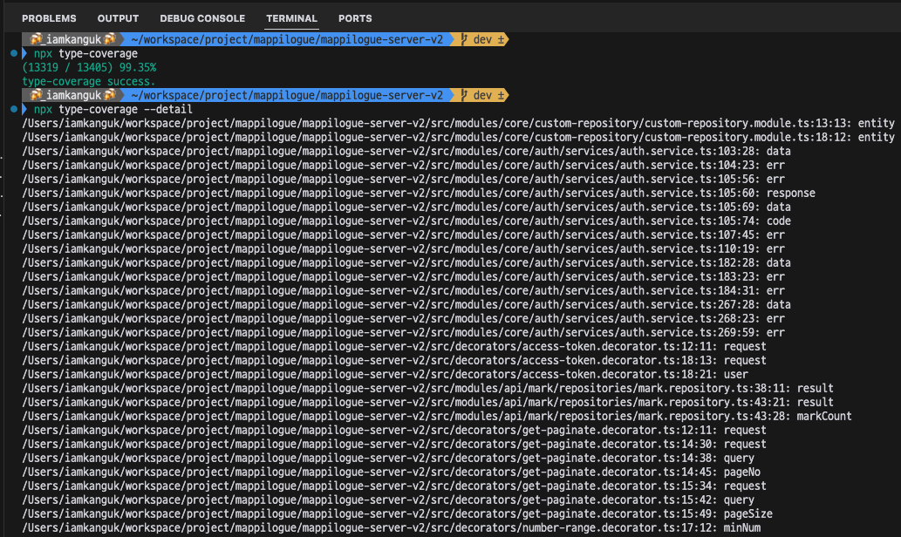

# DIL: 이펙티브 타입스크립트

> 스터디: 월간 CS, https://github.com/monthly-cs/2024-05-effective-typescript  
> 작성일: 2024-06-08<br/>
> 작성자: iamkanguk97

---

## 아이템42: 모르는 타입의 값에는 any 대신 unknown을 사용하기

> unknown에는 함수의 반환값과 관련된 형태, 변수 선언과 관련된 형태, 단언문과 관련된 형태가 있다. 이를 순차적으로 알아보자.

### 함수의 반환값과 관련된 unknown

**함수의 반환값에 타입 선언을 강제할 수 없기 때문에 호출된 곳에서 타입 선언을 생략하게 되면 사용되는 곳마다 타입 오류가 발생한다. 그렇기 때문에 unknown을 반환하도록 만드는 것이 더욱 안전하다.**

### any 타입이 강력하면서 위험한 이유

- 어떠한 타입이든 any 타입에 할당 가능하다.
- any 타입은 어떠한 타입으로도 할당 가능하다 (단, never 타입은 제외)

### unknown 타입

- any 대신에 쓸 수 있는 타입 시스템에 부합하는 타입이다.
- unknown은 어떠한 값이 있지만 타입을 알 지 못할 때 사용하는 타입이다.

### {} vs object vs unknown

- `unknown`은 모든 값을 가질 수 있음
- `{}`는 null과 undefined를 제외한 모든 값을 가질 수 있음
- `object`는 원시 타입을 제외한 모든 타입을 가질 수 있음

### 🤔요약정리🤔

> **unknown은 any 대신 사용할 수 있는 안전한 타입이다. 어떠한 값이 있지만 그 값의 타입을 알지 못하는 경우라면 unknown을 사용하자.**

> **사용자가 타입 단언문이나 타입 체크를 사용하도록 강제하려면 unknown을 사용하면 된다.**

> **{}, object, unknown의 차이점을 이해해야 한다.**

<br/>

## 아이템43: 몽키 패치보다는 안전한 타입을 사용하기

> 시작 전에 `몽키 패치`는 무엇?
>
> 원래 소스코드를 변경하지 않고 실행 시 코드 기본 동작을 추가, 변경 또는 억제하는 기술이다. 쉽게 말해서 어떤 기능을 위해 이미 있던 코드에 삽입하는 것이다.

**자바스크립트의 가장 유명한 특징 중 하나는 객체와 클래스에 임의의 속성을 추가할 수 있을 만큼 유연하다는 것이다.** 객체에 속성을 추가할 수 있는 기능은 종종 웹 페이지에서 `window`나 `document`에 값을 할당해서 전역 변수를 만드는데 사용된다.

```typescript
window.monkey = 'Tamarin';
document.monkey = 'Howler';

// DOM 엘리먼트에 데이터를 추가
const el = document.getElementById('colobus');
el.home = 'tree';

// 내장 기능의 프로토타입에도 속성을 추가할 수 있다
RegExp.prototype.monkey = 'Capuchin';
/123/.monkey; // Capuchin
```

**객체에 임의의 속성을 추가하는 것은 좋은 설계는 아니다.** 여기에 타입스크립트까지 더하게 되면 또 다른 문제가 발생한다.
**타입 체커는 Document와 HTMLElement의 내장 속성에 대해서는 알고 있지만 임의로 추가한 속성에 대해서는 모른다.**

```typescript
document.monkey = 'Tamarin';
//      ~~~~~~~ 'Document' 유형에 'monkey' 속성이 없다.

(document as any).moneky = 'Tamarin'; // 정상

(document as any).monky = 'Tamarin'; // 정상, 오타
(document as any).monkey = /Tamarin/; // 정상, 잘못된 타입
```

**위와 같이 any 단언문을 사용해서 해당 문제를 해결할 수 있지만 any를 사용하면서 타입 안전성을 상실하고 언어 서비스를 사용할 수 없게 된다는 것이다.**

최선의 해결책으로는 document 또는 DOM으로부터 데이터를 분리하는 것이다. 분리할 수 없는 경우(객체와 데이터가 붙어 있어야만 하는 라이브러리를 사용중이거나 자바스크립트 애플리케이션을 마이그레이션하는 과정 중이라면) 두 가지 차선책이 있다.

### interface의 보강을 사용하자

```typescript
interface Document {
  /** 몽키 패치의 속(genus) 또는 종(species) **/
  monkey: string;
}
document.monkey = 'Tamarin'; // 정상
```

보강을 사용한 방법이 any보다 나은 점은 다음과 같다.

- 타입이 더 안전하다. 타입 체커는 오타나 잘못된 타입의 할당을 오류로 표시한다.
- 속성에 주석을 붙일 수 있어야 한다.
- 속성에 자동완성을 사용할 수 있다.
- 몽키 패치가 어떤 부분에 적용되었는지 정확한 기록이 남는다.

### 더 구체적인 타입 단언문

```typescript
interface MonkeyDocument extends Document {
  monkey: string;
}
(document as MonkeyDocument).monkey = 'Macaque'; // 정상
```

**지금 생각해보면... 몽키 패치를 사용할 일이 있을까...?**

### 🤔요약정리🤔

> **전역 변수나 DOM에 데이터를 저장하지 말고 데이터를 분리해서 사용해야 한다.**

> **내장 타입에 데이터를 저장해야 하는 경우 안전한 타입 접근법 중 하나(보강이나 사용자 정의 인터페이스로 단언)를 사용해야 한다.**

> **보강의 모듈 영역 문제를 이해해야 한다.**

<br/>

## 아이템44: 타입 커버리지를 추적하여 타입 안전성 유지하기

> `noImplictAny`를 적용하고 모든 암시적 any 대신 명시적 타입 구문을 추가해도 any 타입과 관련된 문제들로부터 안전하다고 할 수 없다.

### any 타입이 프로그램 내에 존재할 수 있는 경우

- **명시적 any 타입을 선언하는 경우에는 any 타입이 전파될 수 있음**
- **서드파티 타입 선언** (@types 선언 파일로부터 any 타입이 전파될 수 있기 때문)

### type-coverage 패키지를 활용한 any 타입 추적

```shell
# Install
npm i -D type-coverage

# Execute
npx type-coverage

# Get any type's position of this project
npx type-coverage --detail
```



**실제로 TypeScript로 백엔드 환경을 구성한 개인 프로젝트를 type-coverage 테스트를 해봤는데 다음과 같은 결과를 얻을 수 있었다.**

- 13405개의 심벌 중 99.35%가 any가 아니거나 any의 별칭이 아닌 타입을 가지고 있음을 알 수 있다.
- any가 사용되고 있는 위치의 정보들을 얻을 수 있다.

**위의 결과들을 토대로 점수를 따기 위해 타입에 신경을 쓴다면 코드의 품질을 높일 수 있을 것이다.**

### 🤔요약정리🤔

> **`noImplictAny`가 설정되어 있어도 명시적 any 또는 서드파티 타입 선언(@types)을 통해 any 타입은 코드 내에 여전히 존재할 수 있다는 점을 주의해야 한다.**

> **작성한 프로그램의 타입이 얼마나 잘 선언되었는지 추적해야 한다. 추적함으로써 any의 사용을 줄여나갈 수 있고 타입 안전성을 꾸준히 높일 수 있다.**
